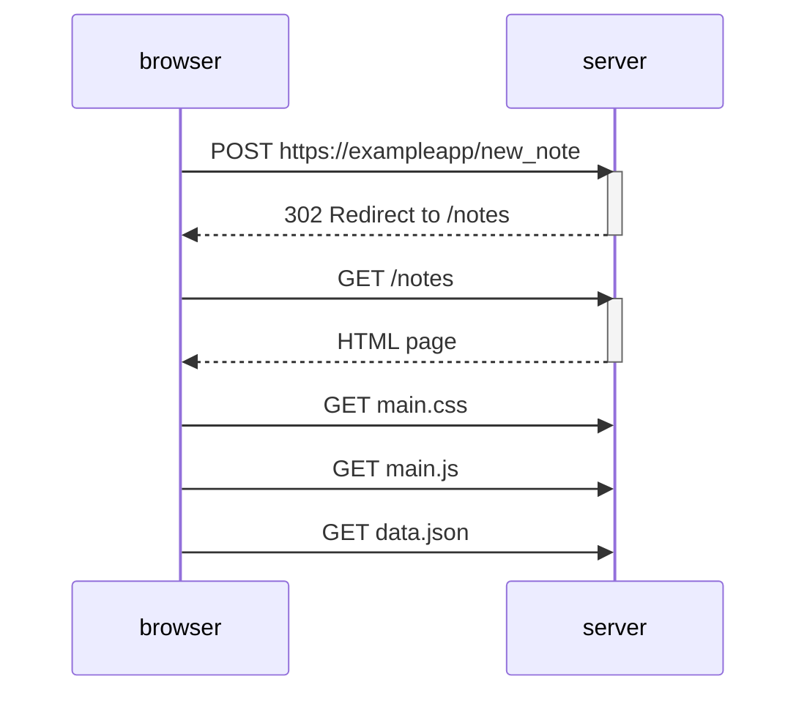
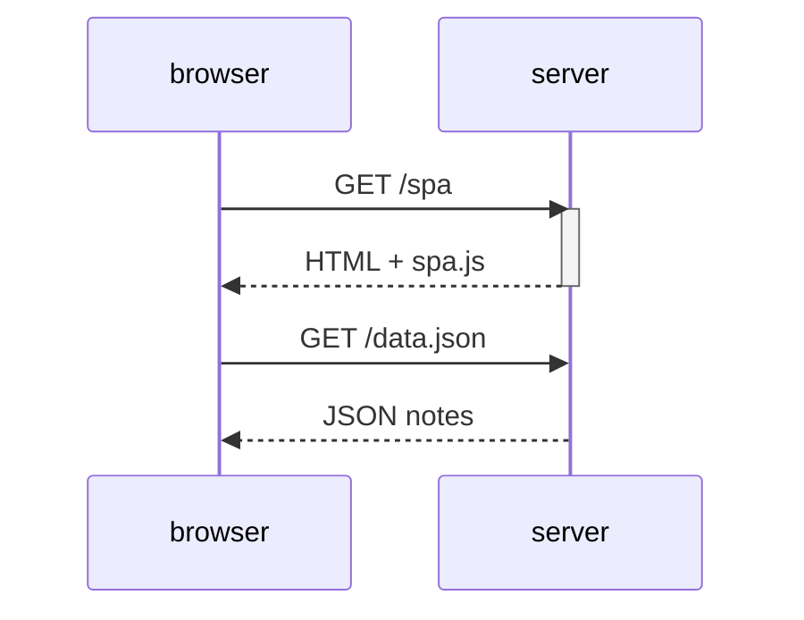
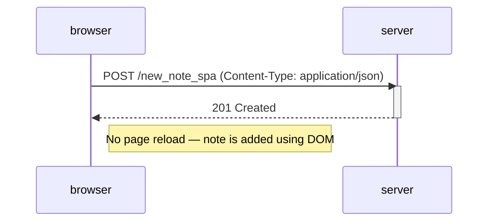

## 0.4: New note diagram

```mermaid
sequenceDiagram
    participant browser
    participant server

    browser->>server: POST https://exampleapp/new_note
    activate server
    server-->>browser: 302 Redirect to /notes
    deactivate server

    browser->>server: GET /notes
    activate server
    server-->>browser: HTML page
    deactivate server

    browser->>server: GET main.css
    browser->>server: GET main.js
    browser->>server: GET data.json
```
## 0.5: SPA page loading

```mermaid
sequenceDiagram
    participant browser
    participant server

    browser->>server: GET /spa
    activate server
    server-->>browser: HTML + spa.js
    deactivate server

    browser->>server: GET /data.json
    server-->>browser: JSON notes
```
## 0.6: Adding new note in SPA

```mermaid
sequenceDiagram
    participant browser
    participant server

    browser->>server: POST /new_note_spa (Content-Type: application/json)
    activate server
    server-->>browser: 201 Created
    deactivate server

    Note right of browser: No page reload — note is added using DOM
```